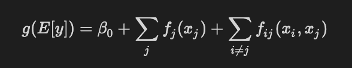
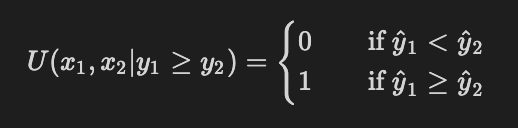

# 🍜 Ramen ratings

## Content
```text
.
├── LICENSE
├── README.md
├── clean_data
│   ├── clean_ramen_ratings.csv
│   ├── ebm_val_data.csv
│   ├── linear_val_data.csv
│   └── ramen_features.csv
├── models
│   ├── ebm.joblib
│   └── linear.joblib
├── raw_data
│   ├── ramen_consumption_by_country.tsv
│   └── ramen_ratings.csv
└── src
    ├── data_cleaning.ipynb
    ├── feature_selection.ipynb
    ├── model_assessment.ipynb
    └── model_evaluation.ipynb
```

| File                                       | Description                                                                                                                            |
| ------------------------------------------ | -------------------------------------------------------------------------------------------------------------------------------------- |
| LICENSE                                    | Contains license for code in this repository.                                                                                          |
| README.md                                  | This file, contains a brief description of the conent of this repository and the data-598-c class final report.                        |
| clean_data/clean_ramen_ratings.csv         | Variables were cleaned and supplemented with additional country based data.                                                            |
| clean_data/ebm_val_data.csv                | Validation data for the model evaluation step of the EBM model.                                                                        |
| clean_data/linear_val_data.csv             | Validation data for the model evaluation step of the linear model.                                                                     |
| clean_data/ramen_features.csv              | Output of the feature_selection notebook containing extracted features from the ramen_features.csv file.                               |
| models/emb.joblib                          | Archive file for EBM model.                                                                                                            |
| models/linear.joblib                       | Archive file for the linear model.                                                                                                     |
| raw_data/ramen_consumptions_by_country.tsv | Ramen consumptions by country obtained from the [World instant noodle association](https://instantnoodles.org/en/noodles/market.html). |
| raw_data/ramen_ratings.csv                 | Ramen ratings were obtained from the [kaggle website](https://www.kaggle.com/residentmario/ramen-ratings).                             |
| src/data_cleaning.ipynb                    | Jupyter notebook explaining the initial data cleaning steps.                                                                           |
| src/feature_selection.ipynb                | Jupyter notebook extracting features for classification task.                                                                          |
| src/model_assessment.ipynb                 | Jupyter notebook assessing the different models..                                                                                      |
| src/model_evaluation.ipynb                 | Jupyter notebook using the validation set and a utility function to evaluate the models.                                               |

## Report

### **Ficticious** Problem statement

QSRA, the Quantified Self Research Agency, is slowly moving away from step counters, activity logbooks and calory trackers in order to have an even greater impact in their member's lives; The group is now actively seeking ways to quanitfy happiness. As part of a preliminary research, the group called upon github.com/alotofdata to investigate how to maximize the groups member's happiness. The initial proxy proposed as a measure of happiness is the mean star rating of ramen products ingested over a member's lifetime.

In order to maximize star rating, we will be creating an app powered by a model capable of predicting ramen product's star rating so that users can consume better ramen (and therefore , we hope, live happier lives 😃).

### Data

#### Ramen ratings

We first discovered a kaggle dataset of ramen ratings which provided its source:
> _"This dataset is republished as-is from the original BIG LIST on https://www.theramenrater.com/."_ - Aleksey Bilogur

| Column   | Description                                                            |
| -------- | ---------------------------------------------------------------------- |
| Review # | Review # of the ramen Variety on theramenrater website.                |
| Brand    | Name of instant noodle maker                                           |
| Variety  | Specific name of instant noodle product                                |
| Style    | Format of instant noodle product                                       |
| Country  | Country manifacturer of instant noodle product                         |
| Stars    | Ratings in as a floating point number between 0 and 5                  |
| Top Ten  | Ranking of the instant noodle product is part of the BIG LIST top ten. |

#### Ramen consumption by country

We then found a second dataset coming from the [World instant noodle association](https://instantnoodles.org/en/noodles/market.html) which is an html table extracted from their website on 01/26/2020.

| Column           | Description                                                    |
| ---------------- | -------------------------------------------------------------- |
| Country / Region | Country / Region of interest                                   |
| 201*             | Year columns; Consumptions in million of servings was recorded |

### Data cleaning & processing

We first cleaned and combined the data obtained from the ramens rating kaggle entry and the World Instant Noodle Association dataset.

The ramens rating dataset was the first explored. We removed the "Review #" and "Top Ten" rows from the ramens rating dataset as they were highly specific and not relevant to our regression problem. We validated that other columns were neither empty / null and in the case of star ratings, negative. We also used the `pycountry` package to validate the country names in our dataset. A few countries had to be renamed to match the `pycountry` package conventions.

We then merged the WINA data into our ramens rating dataset using the country's name using the `pycountry` conventions. 11 rows out of the original 2580 were left out as a result.

After renaming columns, the dataset was exported to the [clean_rament_ratings.csv](clean_data/clean_ramen_ratings.csv) file.

>Each of the above step are explained in additional details in the [data cleaning notebook](src/data_cleaning.ipynb).

### Feature engineering

The clean dataset contained the `Brand`, `Variety`, `Style`, `Stars`, `Country` and `Year` (2014-2018) columns. We examined the columns one by one to determine if features could be extracted / useful for our analysis.

`Brand` was difficult to use ass it had a high cardinality and only a few rows were associated with most brands. We decided not to use this column as a result.

`Variety` contained free-form text associated with the name of the product. We used the length of this field and used the `spacy` python package to extract words and created a boolean column "`spicy`"which indicated whether the product's name mentioned spicyness. This was a highly manual process requiring googling many words to verify whether they were related to spicyness.

`Style` was categorical and had very low cardinality we used the built in pandas function `get_dummies` to create a one hot encoding of this variable.

`Country & Year` both of these column contain the "same" information. We removed the `Country` as a result and kept the year. For each year, values were normalized so that year over year comparison could be drawn.

We added a new boolean column, `Five Year Consumption Increase`, indicating whether there was an increase in ramen consumption.

`Stars` is our target variable and was not altered / used in feature selection.

>Each of the above step are explained in additional details in the [feature selection notebook](src/feature_selection.ipynb).

### Model selection

#### Model #1 - EBM (Explainable Boosting Machines)

Microsoft reasearch has been working to create [interpretable machine learning models](https://github.com/interpretml/interpret) with the same accuracy as non-interpretable models such as random forests and gradient boosted trees. The EBM model uses a mixture of generalized additive models (GAMs) with an added subset of pairwise interactions. (Mixture of tree-based and linear methods)

<div style="text-align:center"></div>

This approach enables the package model to output a 2D graph for every feature explaining their weights and heatmaps explaining pairwise-interactions. These can be leveraged to better understand each feature's contribution to regression values. Students taking the human-centered data science course last quarter were introduced to this effort by Microsoft researchers.

This seems like the ideal model to both have an accurate prediction and understand how the predictions were made. Our datasets fulfills the requirement of being all numeric as well.

#### Model #2 - Penalized Linear Regression

We decided to use a penalized linear regression to contrast with the more complex model. We have picked this model because of its simplicity and interpretability. We are interested to see if the more complex "interpretable" model is as interpretable as the linear option. The target variable is not far from linear so we are hopeful this method will have pretty good results.

Some of the variables are highly correlated so a ridge regression seems to be appropriate to diminish their impact.

The dataset seem to fulfill some, but not all of the requirements of linear model:

- n > p
- normal errors ← Some of the dependents/independent variable do not follow a normal distribution. We will need to look at the residuals.
- independent observations ← Cannot be known for certain that no outside factors swayed the ramen ratings.

### Model training and assessment

We first removed the 3 "Unrated" rows in our dataset. Because so few rows were affected, no additional imputation strategy were used.

We used `scikit-learn`'s `train_test_split` methods to create an 80, 10, 10 split for train, test and validation respectively. 

We created a few utility functions to output a plot of Predicted vs Residuals, qq-plot as well as mean absolute errors, mean squared errors and r squared.

Both models did not have hyperparameters, so we focused on comparing their results and assessing the model's assumptions. We also saved the validation sets and the models in joblib files for the model evaluation step.

We find that the linear model predicts worse than predicting the average while the EBM model did slightly better and explained 8% of the total variance. The graph of the residuals showed that errors weere distributed on both sides (prediction higher and lower than real values) and were largely spread out over the possible range which would indicate that very little information about the target variable is contained within our input features.

We assessed the assumptions of the linear model; the qq plot of residuals showed they were not normaly distributed which further invalidated the linear model's results.

We observed graphs for the built in EBM python package which explained how predictions were made for different values of the feature columns. The feature columns seem to have very little effect on predictions.

>Each of the above step are explained in additional details in the [model assessment notebook](src/model_assessment.ipynb).

### Model evaluation

We defined a utility function based on the comparison of 2 ramen products. When comparing two products, when the product with the highest rating is picked the utility function returns 1 otherwise 0.

<div style="text-align:center"></div>

We first loaded our models and evaluation data created in the model assessment notebook. We then wrote the utility function and ran it on the validation set's predicted scores for both our models. The linear model picked the highest rated ramen 31.67% while the EBM model did marginally better at 33.85%. In this case, picking a ramen product randomly would perform significantly better than using the models.

We also compared these approaches with a naive model which predicted a brand average star rating for every product of that brand. This model exceeded expectations by picking the highest rated ramen product 47.4% of the time.

With the current dataset, we weren't able to create a model which could choose the highest rated ramen between two ramen products with a better accuracy than a random guess. In this case, using the average of the Brand's rating resulted in more accurate predictions than model trained on our features.

>Each of the above step are explained in additional details in the [model evaluation notebook](src/model_evaluation.ipynb).

### Recommendation

When faced with a choice between two brands of ramen, a QSRA member should refer to the [ramen eater's big list](https://www.theramenrater.com/resources-2/the-list/) or, if the products they are interested are not listed, pick a product randomly.